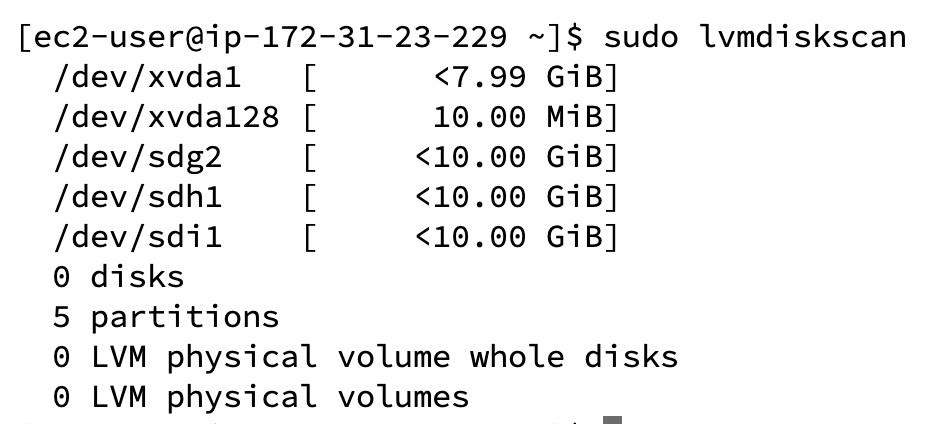

# Implementing Wordpress website with LVM (Logical Volume Management) Storage Management

In this article we will be talking about how we can implement a Wordpress press website using an AWS EC2 instance and Logical Volume Management (LVM) storage.

We will be focusing on 2 parts here, 
1. Configure storage subsystem for Web and Database servers based on Linux OS. We want to focus on working with partitions, volumes, disks in Linux
2. Installing Wordpress website and connecting it with a remote MySQL servers.

As a DevOps Engineer your deep understanding in the web technologies and components will help in troubleshooting web issues.

## Three Tier Acrchitecture 

Generally, the structure of a mobile or web Application is the 3-tier Architecture, which includes the 
1. Presentation Layer (PL) -> This is the user interface layer such as Client - Server or browser on your laptop
2. Business Layer (BL) -> This is the backend that implements the business logic
3. Data Access Layer (DAL) -> This is the layer for computer data storage and data access

#### Our 3-Tier Setup

The 3-tier setup will consist of the following
1. A PC or Laptop to serve as a client
2. An EC2 instance Linux server as a web server (Where we will install Wordpress)
3. An EC2 instance Linux server to act as a DB server

We will be using RedHat Linux OS for this project

## Implementing LVM on Linux Servers (Web and Database Server)

#### Step 1

1. Launch and EC2 instance that will serve as Webserver. Create 3 volumes in the same Availability Zone (AZ) as your EC2 instance (Search for Elastic Block Store, EBS -> create)

#### Output


2. Attach all 3 volumes to your EC2 instance 1 by 1, to do this, right click on the volume id and click on `Attach`


Let's go back to our terminal to begin configuration.

3. Use the `lsblk` command to list all the volumes (EBS) we just added


The names in this `nvme1n1 - nvmen3n1` are the new storages that has been added based on the EBS we installed and attached.

Let us use the command `df -h` to see all the mounts and free space on the server

Also we can use the `gdisk` to create a single partition on all 3 disks

```
sudo gdisk /dev/nvme4n1
```


When prompted, press key `n` for a new partition, press enter for default, and use `8e00` to make the partition a Linux LVM partition then `w` to write & save.

It's time to install the lvm2 utility tool, using the command

```
sudo yum install lvm2 
```

and 

```
sudo lvmdiskscan
```




Next, we need to create physical volumes (PVs) on all 3 partitions using the following command. Confirm creation sof PVs with `sudo pvs`

```
sudo pvcreate /dev/nvme2n1p2 /dev/nvme3n1p1 /dev/nvme4n1p1
```


It is time to now create a volume group for all our physical volumes. VG (Volume Group) is a combination of PVs and can contain as many PVs as possible.

We can create VG using the command `vgcreate` and name this one webdata-vg

```
sudo vgcreate webdata-vg /dev/nvme2n1p2 /dev/nvme3n1p1 /dev/nvme4n1p1
```

And verify the VGs has been created with `sudo vgs`


All the PVs has been combined into one VG.

Let's now create a logical volume (LV) on the Volume group we have created. 

> The essense of a logical volume (LV) is to increase or decrease the space on our Physical Volumes. If the spaces get exhausted, we can extend the volumes rather than destroying them (lvextend)

```
sudo lvcreate -n app-lv -L 14G webdata-vg
```

```
sudo lvcreate -n logs-lv -L 14G webdata-vg
```

and use `sudo lvs` to check the partitions we created


To verify the entire setup, we can use the following

```
sudo vgdisplay -v #view complete setup -VG, PV, LV
sudo lsblk
```


1. We need to use mkfs.ext4 to format the Logical Volumes with ext4 filesystem

```
sudo mkfs.ext4 /dev/webdate-vg/app-lv
sudo mkfs.ext4 /dev/webdate-vg/log-lv
```


Next is to create a mount point for our devices, (Mount points are like default folder for our partition)

Create the following directories

/var/www/html -> to store website files
/home/recovery/logs -> to store backup of log files

```
sudo mkdir -p /var/www/html
sudo mkdir -p /home/recovery/logs
```

Mount /var/www/html to app-lv logical volume

> NB: Make sure there is nothing in the html directory before mounting, because it will delete everything on the directory

```
sudo mount /dev/webdate-vg/app-lv /var/www/html
```

The above command was successful, so it was good, however, for the second direcotry `/var/log`

> Use rysnc utility to backup all the files in the `/var/log` into the /home/recovery/logs this is required before mounting the file system

```
sudo rsync -av /var/log /home/recovery/logs
```

Next is to now mount the `/var/log` device to our log-lv, which will delete all files on the /var/log directory


```
sudo mount /dev/webdate-vg/log-lv /var/log
``` 

Then we restore all the recovery files we copied in the home/recovery folder back to the /var/log folder

```
sudo rsync -av /home/recovery/logs /var/log
```


Currently, if we use the `df -h` command to check the files system, our Logical volumes have been mounted but the issue is that these are temporary mounts.
If the instance is restarted, all the mapping and mounting we did, will all be removed and deleted. So we need a more permanent solution


Let us add the UID of each of the LVs into the `fstab` to permenently save the configuration we just finished. They reside in the blkid, use `sudo blkid` to get your UIDs


To get the edit the fstab run the command then paste into the fstab file
```
sudo nano /etc/fstab 
```


After the configuration, use `sudo mount -a` to check for error, if nothing comes back, we are good

If everything looks good, then it means we can run the command `sudo systemctl daemon reload`


## Installing Wordpress and Configuring MySQL Database

Launch an instance of EC2 on AWS making it your DB server. Then following all the steps already did above, of creating partitions,PVs, LVs and `db-lv` instead of `app-lv` and mount it on the `/db/` instead of /var/www/html

### Step 3: Install Wordpress on the Web Server Instance

Let's prepare our server and install wget, Apache and it's dependencies

```
sudo yum update & sudo yum -y install wget php php-mysqlnd php-fpm php-json
```

Start Apache with this command

```
sudo systemctl enable httpd
sudo systemctl start httpd
```

To install PHP and it's dependencies 

```
sudo yum install https://dl.fedoraproject.org/pub/epel/epel-release-latest-8.noarch.rpm
sudo yum install yum-utils http://rpms.remirepo.net/enterprise/remi-release-8.rpm
sudo yum module list php
sudo yum module reset php
sudo yum module enable php:remi-7.4
sudo yum install php php-opcache php-gd php-curl php-mysqlnd
sudo systemctl start php-fpm
sudo systemctl enable php-fpm
setsebool -P httpd_execmem 1
```

> Restart Apache `sudo systemctl restart httpd`

Download wordpress and copy the wordpress file to `/var/www/html`

```
mkdir wordpress
cd   wordpress
sudo wget http://wordpress.org/latest.tar.gz
sudo tar xzvf latest.tar.gz
sudo rm -rf latest.tar.gz
cp wordpress/wp-config-sample.php wordpress/wp-config.php
cp -R wordpress /var/www/html/
```

Once the installation is complete, you then install the SELinux policies

```
 sudo chown -R apache:apache /var/www/html/wordpress
 sudo chcon -t httpd_sys_rw_content_t /var/www/html/wordpress -R
 sudo setsebool -P httpd_can_network_connect=1
```


### Installing mySQL on your DB EC2 instance

```
sudo yum update
sudo yum install mysql-server
```

Verify that the service is running by `sudo systemctl status mysqld` if the service is not running, run the following command to restart and enable the mysql service

```
sudo systemctl restart mysqld
sudo systemctl enable mysqld
```

> Configure DB to work with Wordpress

```
sudo mysql
CREATE DATABASE wordpress;
CREATE USER `myuser`@`<Web-Server-Private-IP-Address>` IDENTIFIED BY 'mypass';
GRANT ALL ON wordpress.* TO 'myuser'@'<Web-Server-Private-IP-Address>';
FLUSH PRIVILEGES;
SHOW DATABASES;
exit
```


### Step 6: Configure DB to work with Wordpress

> Hint: For security reasons, do not forget to open MySQL port 3306 on the DB server to allow connection to ONLY the webserver IP address


Install MySQL client on the webserver and ensure you can connect to the DB server from the Webserver

```
sudo yum install mysql
sudo mysql -u admin -p -h <DB-Server-Private-IP-address>
```
If the above is not working. fix with the following code

```
sudo wget https://dev.mysql.com/get/mysql57-community-release-el7-11.noarch.rpm
sudo yum localinstall mysql57-community-release-el7-11.noarch.rpm 
sudo yum install mysql-community-server
sudo systemctl start mysqld.service
```


Let's go back to our Webserver and configure the `wp-config.php` file

> sudo nano wp-config.php

Make the changes on the php config file and configure the webserver folder to be apache:apache, everything is currently root.

```
sudo chown -R apache:apache /var/www/html/wordpress
sudo chcon -t httpd_sys_rw_content_t /var/www/html/wordpress -R
```

Goto your your browser and type 

```
http:<Public-Address-IP-Address->/wordpress
```


Annnnnnnndddddddddd BOOM!!! It works

